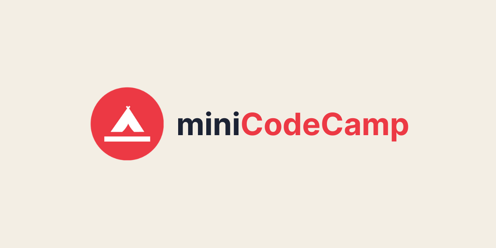

# miniCodeCamp

A free online mini coding bootcamp

## Demo

Here's a quick demo of the app.

[miniCodeCamp - A free online mini coding bootcamp ](https://www.youtube.com/watch?v=_NzqJY8Ynck)

## Run Locally

Clone the project

```bash
  git clone https://github.com/GeekyChakri/miniCodeCamp.git
```

Go to the project directory

```bash
  cd miniCodeCamp
```

Install dependencies

```bash
  npm install
```

Create an .env file in root and add your variables

```
  NEXT_PUBLIC_CLERK_PUBLISHABLE_KEY=
  CLERK_SECRET_KEY=
  MONGODB_URI=
```

Start the app

```bash
  npm run dev
```

## Tech Stack

- **NextJS**

- **MongoDB**

- **Clerk**

- **Vercel**

## Author

[GeekyChakri](https://www.github.com/GeekyChakri)
